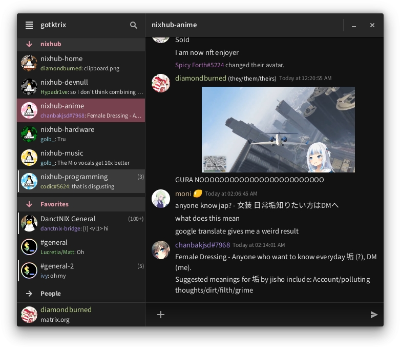

# gotktrix



Work-in-progress Matrix client in Go and GTK4.

## What's working?

Below is a non-exhaustive list of implemented features:

- Message receiving, sending and editing
- Emojis, custom and built-in
- Autocompletion
- Images
- Mobile support (partial)

## Building

```sh
go build
```

### Dependencies

See [package.nix](.nix/package.nix).
