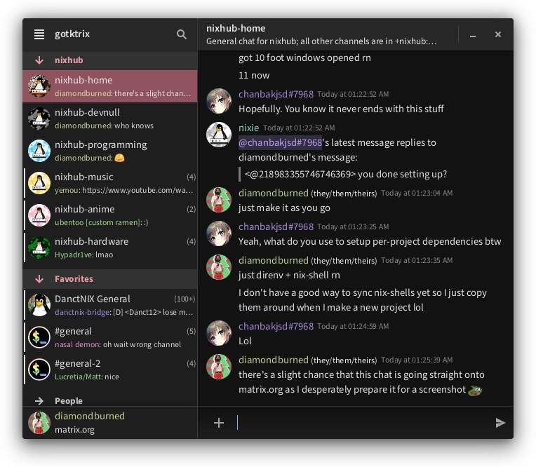

# gotktrix



Work-in-progress Matrix client in Go and GTK4.

## Features

List taken from the Features section of the
[Clients Matrix](https://matrix.org/clients-matrix/) page.

- [x] Room directory
- [ ] Room tag showing
- [ ] Room tag editing
- [x] Search joined rooms
- [ ] Room user list
- [ ] Display Room Description
- [ ] Edit Room Description
- [ ] Highlights
- [ ] Push rules
- [x] Send read markers
- [ ] Display read markers
- [ ] Sending Invites
- [ ] Accepting Invites
- [x] Typing Notification (receive-only)
- [ ] E2EE
- [x] Replies
- [x] Attachment uploading
- [x] Attachment downloading
- [ ] Send stickers
- [x] Send formatted messages markdown
- [x] Rich Text Editor for formatted messages
- [x] Display formatted messages
- [x] Redacting
- [x] Multiple Matrix Accounts
- [ ] New user registration
- [ ] VoIP (non-goal)
- [x] Reactions
- [x] Message editing
- [ ] Room upgrades
- [ ] Localizations (untested, outdated)
- [x] SSO Support

Additionally, the client implements:

- Custom and Unicode Emojis
- Autocompletion
- Mobile support (partial)

## Building

```sh
go build
```

### Dependencies

See [package.nix](.nix/package.nix).
